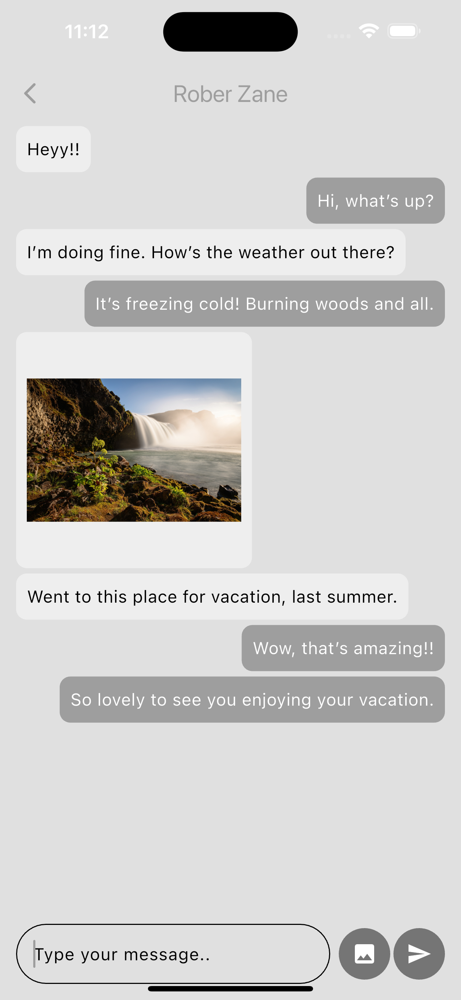
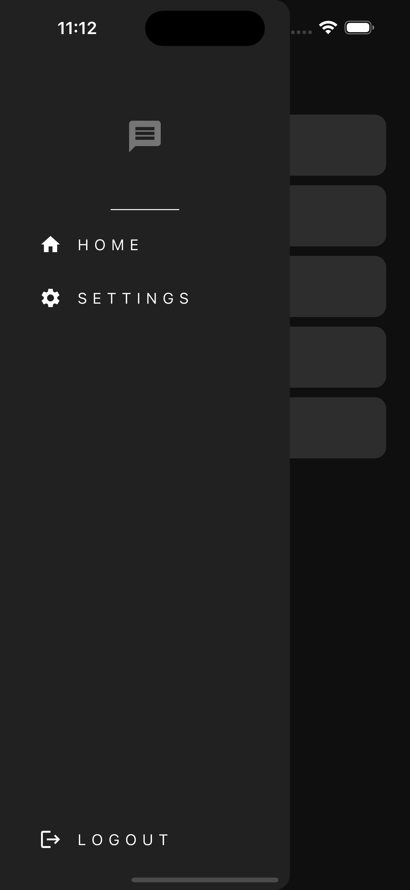
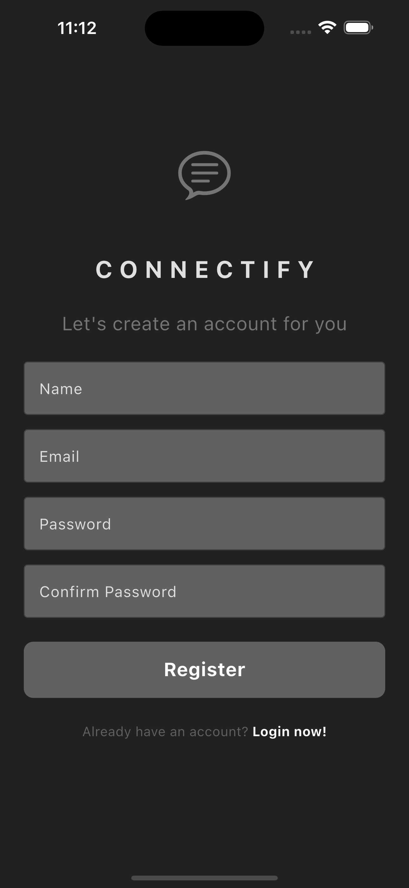

# Connectify

A clean & modern Flutter demo app showcasing authentication, secure storage, state management with *
*Provider**.

  
  
  
  

---

## 🧭 Overview

Connectify is a lightweight Flutter project demonstrating:

- 💬 Real-time messaging powered by Firebase Firestore.
- 🖼️ Image sharing with cloud storage support.
- 🔐 User authentication using Firebase Auth.
- 🧩 Global state management with Provider
- ⚡ Instant UI updates with live data streams
- 🎨 Minimal, modern UI optimized for chat flows

Perfect for beginners learning Flutter state management, or for devs bootstrapping an app with auth.

---

## 📸 Screenshots

  
  
  
  
  
  
  

